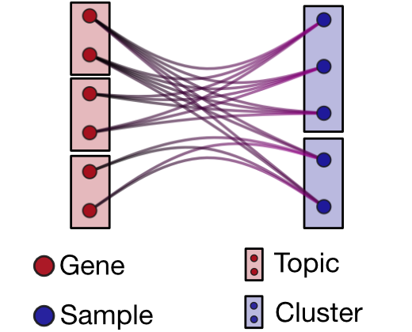

[](https://github.com/BioPhys-Turin/topics/actions/workflows/docker-image.yml)

# Exploring the latent space of transcriptomic data with topic modeling
Material for [*Exploring the latent space of transcriptomic data with topic modeling*](https://www.biorxiv.org/content/10.1101/2024.10.31.621233v1)

See **[analyses](analyses.md)** for a detailed description of all the steps to reproduce the analyses



# Environment
The easiest way to run all the notebooks of this repository with all dependencies handled correctly is using Docker.

You can enable *jupyter lab* with *docker-compose*
```bash
docker-compose up -d
```

then point your browser to [localhost](http://localhost:8888)


# Package
A Python package with used functions can be downloaded from [https://pypi.org/project/topicpy/](https://pypi.org/project/topicpy/)
```bash
pip install topicpy
```
